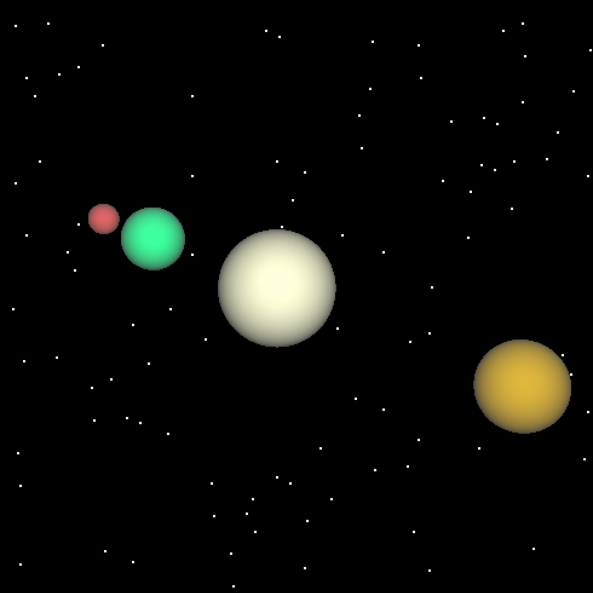

# Solarscape

This program uses OpenGL to display a simple space simulation. Several planetary bodies sit in a field of stars, spinning and rotating around each other. Keyboard commands provide some limited camera control.

And, since the spin isn't really noticeable on untextured spheres, there's also the option to change everything to teapots.

I originally wrote this a while ago, so there are some warnings about now-deprecated APIs.

## Running the program

Written with Mac OS in mind.

To compile code into an executable, run `make`

Then run the executable to view the planets.

## Controls

Current key bindings are as follows:

 * up/down arrow keys - moves camera closer or farther away from the action
 * left/right arrow keys - x axis
 * x/c - moves camera up or down (y axis), but keeps camera pointed at (0,0)
 * r/t - rotates left or right
 * s/d - tilts camera
 * p - toggles teapot mode
 * esc - exits the program

The window can also be resized as desired.
